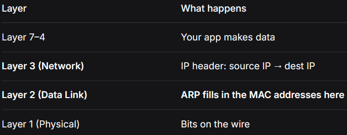
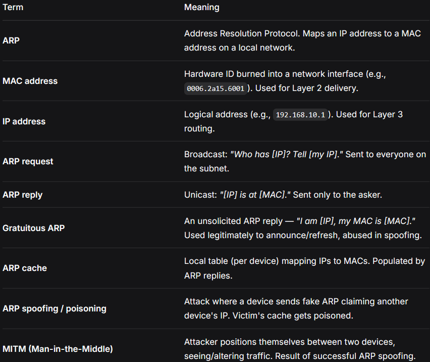
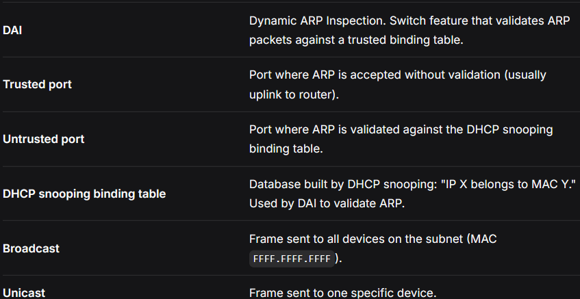
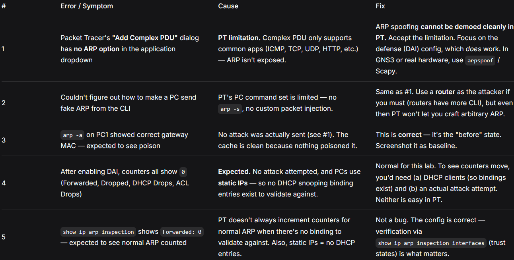
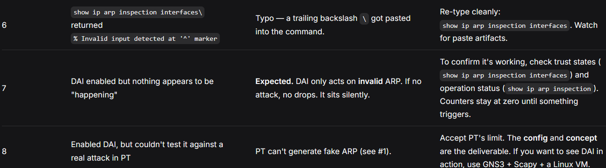

# arp-lab/README.md 🦈

# ARP Lab — Theory + Steps

## The vulnerability

ARP has zero authentication.

Anyone can shout "`192.168.1.1` is at MY MAC!" — and devices will believe them and update their cache. That's how **ARP spoofing** works.

The red flags you'd see if you are in Wireshark:

- **Two different MACs** claiming the same IP in a short window → someone's lying
- A flood of ARP replies you never asked for → someone's **poisoning** the cache
- **Gratuitous ARP** (unsolicited "I am at this MAC!") from an unexpected source
- One MAC claiming to be the **gateway** when it isn't

You can't see it easily in normal traffic — it just looks like ARP. The attacker is clever because they're sending legitimate-looking ARP, just with a lie inside.

---

## The problem ARP solves

On a local network, devices talk using **MAC addresses** (hardware IDs, like `a4:5e:60:xx:xx:xx`).

But you — the human, the app, the OS — only know IP addresses (like `192.168.1.1`).

So when your laptop wants to send a packet to `192.168.1.1`, it knows the IP but not the MAC. And Ethernet/Wi-Fi frames can't be _delivered without_ a MAC.

ARP is the **translation service**. It asks: "Hey everyone, who owns this IP? Tell me your **MAC**."

Problem is ARP has zero authentication. So we use **Dynamic ARP Inspection (DAI)**.

The switch:

1. Watches all ARP packets on _untrusted_ ports
2. Compares them against the **DHCP snooping** binding table (a list of "IP X belongs to MAC Y")
3. If the ARP says "I'm X" but the binding table says X is a _different_ MAC → drop it

This only works if **DHCP snooping** is already configured, because DAI needs the binding table. So there's a dependency chain:

```
DHCP snooping (records real IP↔MAC pairs)
↓
DAI (validates ARP against that table)
```

Same shape as the other defenses: **trusted ports** for _legitimate_ traffic, **untrusted ports** get _validated_ or _dropped_.

---

## ARP between two messages

Question (broadcast — shouted to everyone):

```
Who has 192.168.1.1? Tell 192.168.1.47
Read as: "Whoever owns 192.168.1.1, please reply to me at 192.168.1.47."
```

Answer (unicast — private reply):

```
192.168.1.1 is at a4:5e:60:12:34:56
Read as: "192.168.1.1 is at MAC a4:5e:60:12:34:56."
```

The asking device writes this down in its ARP cache (a small table: IP → MAC), so it doesn't have to ask again for a while.

Here is the full sequence, one picture:

```
Laptop (192.168.1.47) wants to reach Router (192.168.1.1)

Laptop → EVERYONE (broadcast): "Who has 192.168.1.1? Tell 192.168.1.47"
Router → Laptop (unicast): "192.168.1.1 is at a4:5e:60:12:34:56"
Laptop saves it: 192.168.1.1 = a4:5e:60:12:34:56 ✅
```

Now it can send the packet. **That's it.**

Every first contact on a LAN has to start with this little two-step dance.

### Where it sits in the OSI model



---

## Key terms




---

## Lab steps

### Phase 0 — Baseline

1. New file. Place:
    - **1 × Router** (R1)
    - **1 × Switch** (SW1, 2960)
    - **2 × PC** (PC1 & ROGUE)
2. Cable:
    - R1 Gi0/0 ↔ SW1 Gi0/1 (Copper Straight-Through)
    - SW1 Fa0/1 ↔ PC1 Fa0
    - SW1 Fa0/2 ↔ PC-ROGUE Fa0
3. Configure R1:
    ```
    enable
    configure terminal
        interface gigabitEthernet 0/0
        ip address 192.168.10.1 255.255.255.0
        no shutdown
        exit
    end
    write
    ```
4. PC1 gets `192.168.10.10`, mask `255.255.255.0`, gateway `192.168.10.1`.
5. PC-ROGUE gets `192.168.10.20`, mask `255.255.255.0`, gateway `192.168.10.1`.

### Phase 1 — Observe (Pre-Attack)

1. On PC1 → Command Prompt:
    ```
    text
    ping 192.168.10.1
    ping 192.168.10.20
    Both should succeed.
    ```
2. Follow with `arp -a`:
    ```
    text
    arp -a
    ```
3. You'll see the ARP cache:
    ```
    text
    Internet Address      Physical Address      Type
    192.168.10.1          00xx.xxxx.xxxx        dynamic
    192.168.10.20         00xx.xxxx.xxxx        dynamic
    ```
4. Screenshot or note it as the "before" state. That's the **real gateway MAC**.

### Phase 2 — Foreword

PT command set is limited. Complex PDU doesn't expose ARP.

The tools you'd use in a real lab — arpspoof, Scapy, ettercap — don't even exist in PT.

In conclusion:

- We _can't easily_ demo the attack in PT. That's a _sim limitation_, not a "you did something wrong."
- We are skipping the **attack demo** and go _straight to_ the defense.

### Phase 3 — Defense Setup & Demostration

1. On SW1, enable DHCP snooping:
    ```
    enable
    configure terminal
    ip dhcp snooping
    ip dhcp snooping vlan 1
    interface gigabitEthernet 0/1
        ip dhcp snooping trust
    exit
    ```
2. Then, enable DAI:
    ```
    ip arp inspection vlan 1
    interface gigabitEthernet 0/1
        ip arp inspection trust
    exit
    end
    write
    ```
3. Verify DAI is running:

    ```
    show ip arp inspection
    ```

    **Expected output:**

    ```
    Source Mac Validation      : Disabled
    Destination Mac Validation : Disabled
    IP Address Validation      : Disabled

    Vlan     Configuration    Operation   ACL Match          Static ACL
    ----     -------------    ---------   ---------          ----------
    1        Enabled          Active

    Vlan     ACL Logging      DHCP Logging
    ----     -----------      ------------
    1        Deny             Deny
    ```

4. Verify DAI interfaces:

    ```
    show ip arp inspection interfaces
    ```

    **Expected output:**

    ```
    Interface        Trust State     Rate (pps)    Burst Interval
    ---------------  -----------     ----------    --------------
    Gi0/1            Trusted         None          N/A
    Fa0/1            Untrusted       15            5
    Fa0/2            Untrusted       15            5
    ...
    ```

    **Trusted = Gi0/1 (uplink to R1). Untrusted = everything else.**

---

## Errors & Solutions

Real problems hit during this lab, and how they were resolved. PT-specific quirks included — because those are half the battle.




---

### The pattern behind these errors

Same as ARP — three categories:

1. Correct behavior mistaken for a fault (#3, #4, #5, #7)
    - No attack → no drops
    - Static IPs → no binding table → DAI has nothing to validate against
    - Counters at zero = expected, not broken

2. Tool-specific quirks (#1, #2, #6, #8)
    - PT doesn't expose ARP in Complex PDU
    - PT PCs can't send custom ARP
    - Paste artifacts (`\`) break commands
    - These don't exist in GNS3, EVE-NG, or on real hardware

3. Real constraints (#7)
    - DAI is invisible when there's no attack. The absence of errors is the proof it's working.
    - Trust states (Trusted / Untrusted) are the real verification — not counters.

---

## What I learned

- PT's ARP tooling is _genuinely weak_. Unlike STP and DHCP, where you could demonstrate the attack, ARP spoofing is not really reproducible in PT. This is a **known limitation**, not a knowledge gap.
- DAI's correctness is proven by **trust state**, not by counters. A DAI config that's never triggered looks identical to a DAI config that's broken — unless you check show `ip arp inspection interfaces`. That's the real verification.
- **DHCP snooping** is a prerequisite for DAI. Without DHCP snooping binding entries, DAI has nothing to validate against. The dependency chain matters:
    ```
    DHCP snooping → binding table → DAI validates ARP against it
    ```
