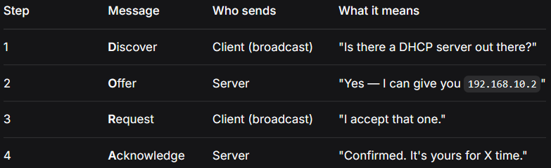
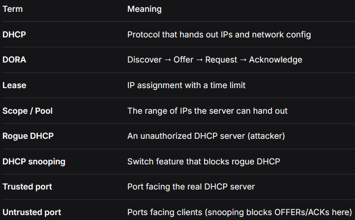
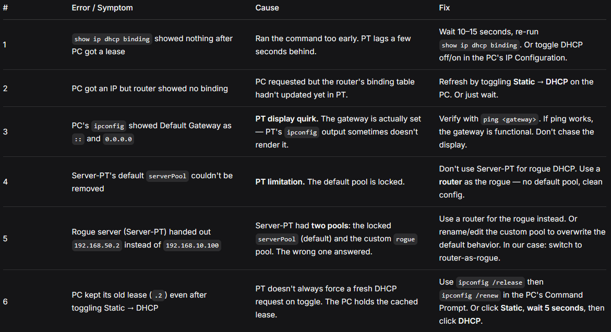
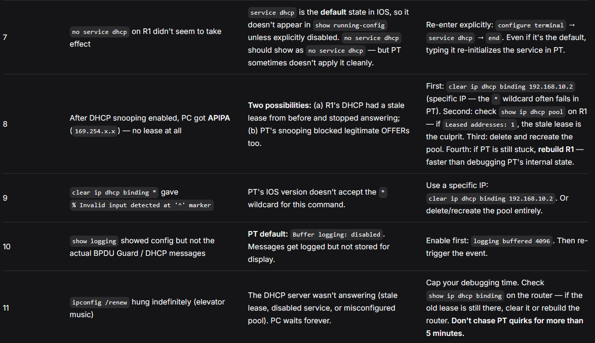
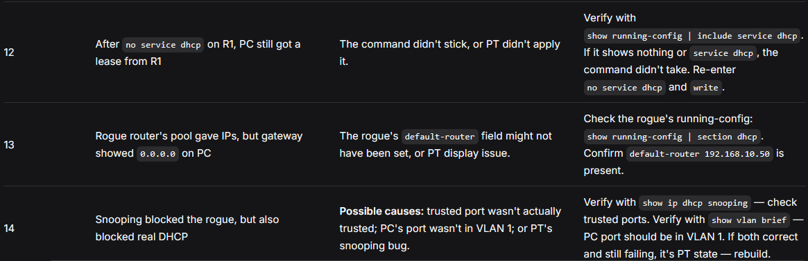

# dhcp-lab/README.md

# DHCP Lab — Theory + Steps 🦈

## The vulnerability

**DHCP has no authentication.** Anyone on the network can answer a DHCP request. The client trusts whoever replies **first**.

That means an attacker can:

1. Plug in a device running a DHCP server
2. Reply **faster** than the real server (attackers do this on purpose)
3. Hand out IPs that point the **gateway to themselves**
4. Now all the victim's internet traffic flows through the attacker

**This is called a rogue DHCP server attack.** The client doesn't know anything is wrong. The network looks fine. The attacker is in the middle of everything.

---

## The problem DHCP solves

Every device on a network needs:

- An **IP address**
- A **subnet mask**
- A **default gateway** (how to reach other networks)
- A **DNS server** (how to resolve names)

You _could_ configure all of this manually on every device. But:

- It doesn't scale (imagine 200 PCs)
- People make mistakes (typos, wrong subnet)
- Reusing IPs becomes a nightmare

**DHCP (Dynamic Host Configuration Protocol)** automates it. A device shows up, asks "can I have an IP?", a server replies with everything it needs. Done.

---

## The DORA sequence

Every DHCP lease follows the same four messages:



**Memorize DORA.** You'll see it in every interview and every packet capture.

---

## Key terms



---

## Lab steps (Packet Tracer)

### Phase 0 — Baseline (working DHCP)

1. New file. Place:
    - **1 × Router** (R1)
    - **1 × Switch** (SW1, 2960)
    - **1 × PC** (PC0)
2. Cable:
    - R1 Gi0/0 ↔ SW1 Gi0/1 (Copper Straight-Through)
    - SW1 Fa0/1 ↔ PC0 Fa0
3. Configure R1:
    ```
    enable
    configure terminal
    interface gigabitEthernet 0/0
     ip address 192.168.10.1 255.255.255.0
     no shutdown
     exit
    ip dhcp pool LAN
     network 192.168.10.0 255.255.255.0
     default-router 192.168.10.1
     dns-server 8.8.8.8
     exit
    end
    write
    ```
4. On PC0: Desktop → IP Configuration → **DHCP**
5. Wait ~10 seconds. PC gets `192.168.10.2`, gateway `192.168.10.1`.

### Phase 1 — Observe

On R1:

```
show ip dhcp binding
```

Should show the PC's MAC address and the assigned IP.

```
show ip dhcp pool
```

Shows pool stats — total addresses, leased addresses.

### Phase 2 — Add rogue DHCP server

1. Delete the Server-PT approach (its default `serverPool` can't be removed in PT).
2. Instead, add a **second router** — label it **ROGUE-R1**.
3. Cable: ROGUE-R1 Gi0/0 ↔ SW1 Fa0/5.
4. Configure ROGUE-R1:
    ```
    enable
    configure terminal
    interface gigabitEthernet 0/0
     ip address 192.168.10.50 255.255.255.0
     no shutdown
     exit
    ip dhcp pool rogue
     network 192.168.10.0 255.255.255.0
     default-router 192.168.10.50
     dns-server 8.8.8.8
     exit
    end
    write
    ```

**Note:** the rogue's `default-router` points to **itself** (`192.168.10.50`), not the real router. **That's the whole attack.** When a client asks for an IP, the rogue replies: _"Here's an address, and by the way, your gateway is ME."_

### Phase 3 — Trigger the attack

1. On R1, temporarily disable DHCP so it doesn't win the race:
    ```
    configure terminal
    no service dhcp
    end
    ```
2. On PC0: Desktop → IP Configuration → **Static** → **DHCP**
3. Wait ~10 seconds. Check the PC's IP and gateway.

**Expected:** PC gets `192.168.10.x` with gateway `192.168.10.50` — **the rogue.**

### Phase 4 — Verify the hijack

On PC0, Command Prompt:

```
ipconfig
```

Gateway should be `192.168.10.50` (rogue).

```
tracert 8.8.8.8
```

First hop should be `192.168.10.50` — **the attacker.**

**That's MITM in one command.** Every packet from the PC now flows through the rogue.

### Phase 5 — Install DHCP snooping (the defense)

**Before snooping:**

- Trusted port: **Gi0/1** (facing the real R1)
- Untrusted ports: **everything else** (Fa0/1 = PC, Fa0/5 = rogue)

**On SW1:**

```
enable
configure terminal
ip dhcp snooping
ip dhcp snooping vlan 1
interface gigabitEthernet 0/1
 ip dhcp snooping trust
 exit
end
write
```

### Phase 6 — Verify

```
show ip dhcp snooping
```

Expected:

- DHCP snooping enabled
- VLAN 1 configured
- **Gi0/1: Trusted = yes**
- **Fa0/1, Fa0/5: Trusted = no**

**That's the config.** One trusted port. Everything else untrusted.

### Phase 7 — Re-test the attack

1. Re-enable DHCP on R1:
    ```
    configure terminal
    service dhcp
    end
    ```
2. On PC0: Static → DHCP.
3. Check `ipconfig`.

**Expected:**

- **If snooping works:** PC gets a real lease (`192.168.10.2`, gateway `192.168.10.1`)
- **If snooping blocks everything:** PC gets APIPA (`169.254.x.x`) — no lease at all
- **If snooping fails:** PC gets a rogue lease (`.50` gateway) — attack succeeded

**What we actually saw:** APIPA. The rogue's OFFERs were blocked ✅, but R1's stale lease also blocked new offers. PT state issue, not a snooping failure.

### Phase 8 — Verify with Simulation Mode

Simulation mode (bottom-right toggle) shows packets hop-by-hop.

1. Switch to Simulation mode
2. On PC0: `ipconfig /renew`
3. Watch the event list

**You should see:**

- **DHCP DISCOVER** from PC0
- It passes through SW1
- Arrives at **R1**
- PDU details: UDP 68 → 67, IP `0.0.0.0 → 255.255.255.255`, MAC broadcast

**This proves:** SW1 is forwarding the DISCOVER. Snooping isn't blocking legitimate traffic. The problem is on R1's side (stale lease).

---

## Errors & Solutions

Real problems hit during this lab, and how they were resolved. PT-specific quirks included — because those are half the battle.







## The pattern behind these errors

Same as DHCP — three categories:

**1. Correct behavior mistaken for a fault (#2, #7, #11)**

    - DHCP takes time. Logging isn't instant. PT displays are quirky. None of these are bugs.

**2. PT-specific quirks (#4, #5, #6, #9, #10, #14)**

    - Server-PT's locked serverPool
    - Wildcard not working in `clear ip dhcp binding *`
    - Buffer logging off by default
    - Stale lease states
    - Display glitches for gateway fields
    - These don't exist on real gear (or behave differently). Note them, don't fight them.

**3. Real config mistakes (#1, #3, #8, #12, #13)**

    - Forgetting to disable DHCP on the real router before testing the rogue
    - Not clearing stale leases
    - Not verifying with show running-config

**Lesson:** These are legitimate troubleshooting steps on real hardware too.

---

## What I learned

- **DHCP is a trust protocol.** No authentication. First reply wins.
- **Rogue DHCP is a real attack.** Easy to set up. Hard to detect. The attacker becomes the gateway.
- **DHCP snooping is the fix.** Trusted port for real server. Everything else untrusted. Rogue OFFERs dropped.
- **Same pattern as every trust protocol:** trust → attack → defense.
- **DHCP leases are stateful.** Stale leases on the server block new assignments if not cleared. `clear ip dhcp binding` is the tool.
- **PT's Server-PT has a phantom `serverPool`** that can't be removed. Use a **router as the rogue** instead — cleaner.
- **`ipconfig /renew` hangs in PT** when no server answers. Don't debug forever — check bindings, clear stale leases, or rebuild.
