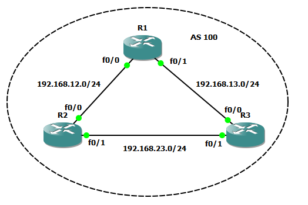
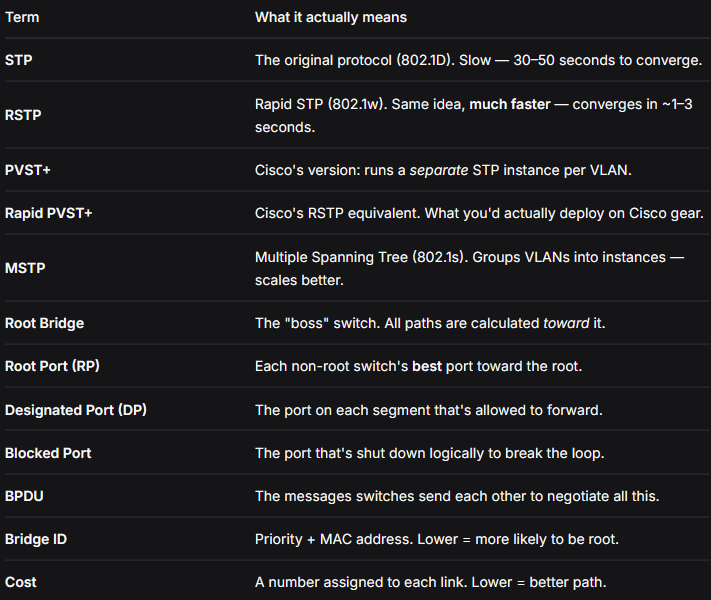
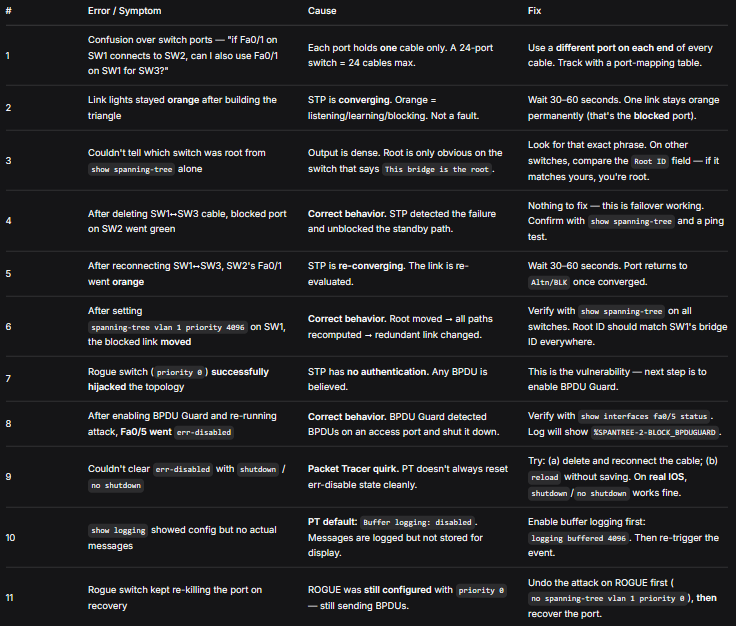

# stp-lab/README.md

# STP Lab — Theory + Steps 🦈

## The problem STP solves

Switches forward **broadcasts** out every port except the one they came in on. If there's a **physical loop** in the topology, a broadcast will:

1. Arrive at Switch B from A
2. B floods it to C
3. C floods it back to A
4. A floods it back to B
5. **Forever.**



This is a **broadcast storm**. Network dies in seconds. But you _need_ redundant links, or one cable cut kills everything.

**Contradiction:** loops kill networks, but redundancy needs loops.

**STP's answer:** let switches negotiate which links to use and **block** the rest. Physical redundancy, logical tree. If a link fails, the blocked one takes over.

> ### **Physically redundant. Logically a tree.**

## How STP picks the topology

1. **Elect root bridge.** Lowest Bridge ID (priority + MAC) wins.
2. **Each non-root switch picks a Root Port.** Lowest-cost path to root.
3. **Each segment picks a Designated Port.** Lowest cost to root wins; the other becomes blocked.

Result: one path to root per switch. No loops. Redundant links blocked but ready.

---

## Key terms



---

## Lab steps (Packet Tracer)

### Phase A — Build the loop

1. Place **3 × Switch 2960**. Label SW1, SW2, SW3 (triangle layout).
2. Cable them into a triangle with Copper Straight-Through:
    - SW1 Fa0/1 ↔ SW2 Fa0/1
    - SW1 Fa0/2 ↔ SW3 Fa0/1
    - SW2 Fa0/2 ↔ SW3 Fa0/2
3. Add **2 × PC**. PC1 → SW2 Fa0/3. PC2 → SW3 Fa0/3.
4. Configure IPs:
    - PC1: `192.168.1.10 / 255.255.255.0`
    - PC2: `192.168.1.20 / 255.255.255.0`
5. Wait ~60 seconds. One link light stays **orange** (blocked).
6. Ping PC1 → PC2. **Works.** STP blocked the loop.

### Phase A — Observe

On each switch CLI:

```
enable
show spanning-tree
```

Note:

- Which switch is **root** (`This bridge is the root`)
- Each switch's **Root Port** (which port leads to root)
- Which link is **Altn/BLK** (the blocked one)

### Phase B — Break it

1. Delete the **active** cable (one of the forwarding links).
2. Watch the blocked port **turn green** within seconds.
3. Ping PC1 → PC2. **Still works.** Traffic rerouted.
4. Reconnect the cable. Watch the port go back to **orange** (blocked again).

### Phase C — Change root

Force a specific switch to be root:

```
configure terminal
spanning-tree vlan 1 priority 4096
```

Wait ~30s. Run `show spanning-tree` on all switches. **Root moved. Blocked link moved.** STP recomputed the whole tree.

### Phase D — Attack with rogue switch

1. Add a **4th switch** (ROGUE). Cable to SW2 Fa0/5.
2. On ROGUE:
    ```
    enable
    configure terminal
    spanning-tree vlan 1 priority 0
    ```
3. Wait ~30s. Check SW2:
    ```
    show spanning-tree
    ```
    **SW2's root port moved to Fa0/5.** The rogue is now root. **Topology hijacked.**

### Phase D — Defend with BPDU Guard

1. Undo the attack on ROGUE (`no spanning-tree vlan 1 priority 0`). Let it settle.
2. On SW2:
    ```
    configure terminal
    interface fa0/5
     spanning-tree portfast
     spanning-tree bpduguard enable
     exit
    ```
3. Re-run the attack on ROGUE (`spanning-tree vlan 1 priority 0`).
4. Check SW2:
    ```
    show interfaces fa0/5 status
    ```
    **Status: `err-disabled`.** The rogue's port died. Network untouched.

### Phase D — Recover the port

Undo the attack on ROGUE first (`no spanning-tree vlan 1 priority 0`).

Then on SW2:

```
configure terminal
interface fa0/5
 shutdown
 no shutdown
 exit
```

**Note (PT quirk):** Sometimes PT doesn't clear err-disable with shutdown/no shutdown. Deleting and re-adding the cable fixes it. In real IOS, shutdown/no shutdown works fine.

---

## Errors & Solutions

Real problems hit during this lab, and how they were resolved. PT-specific quirks included — because those are half the battle.



## The pattern behind these errors

Look at the list. Most of them are one of three types:

**1. Correct behavior mistaken for a fault (#2, #4, #5, #6, #8)**

    - STP converging, failing over, re-converging, and defending all look like "something's wrong" if you don't know what to expect.

**2. PT-specific quirks (#9, #10)**

    - Not real-world problems. Simulator limitations. Note them so future-you doesn't chase them.

**3. Real config mistakes (#1, #11)**

    - Port confusion and forgetting to undo the attack. Legitimate things to remember.

**The lesson:** in networking, "it's not working" is almost never one thing. It's either expected behavior, a tool quirk, or a config mistake. Distinguishing them is the actual skill.

---

## What I learned

- **STP is a trust protocol.** No authentication. Any BPDU is believed.
- **Root placement is a design decision.** Set priority manually or a random switch becomes root.
- **BPDU Guard is the patch** for STP's trust assumption. Access ports should never receive BPDUs.
- **Same pattern as every other trust protocol:** trust → attack → defense (BPDU Guard, DHCP snooping, DAI...).
